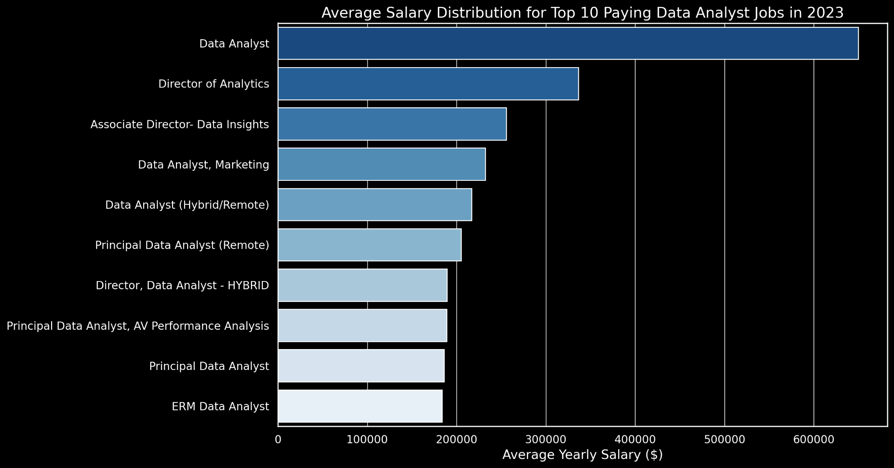

# SQL Project: Data Job Market Analysis

## Introduction

This project analyzes the data analyst job market using SQL.

The goal of this project is to explore job opportunities, salaries, and skills that are valuable for Data Analyst roles. The analysis focuses on identifying top-paying jobs, in-demand skills, high-paying skills, and the most optimal skills to learn.

## Questions I Wanted to Answer

1. What are the top-paying Data Analyst jobs?
2. What skills are required for these top-paying jobs?
3. What skills are most in demand for Data Analysts?
4. Which skills are associated with higher salaries?
5. What are the most optimal skills to learn?

## Tools Used

- **SQL** - Used to query and analyze the job market data.
- **PostgreSQL** - Used as the database management system.
- **Visual Studio Code** - Used to write and execute SQL queries.
- **Git & GitHub** - Used for version control and project sharing.

## Analysis

### 1. Top-Paying Data Analyst Jobs

This analysis identifies the highest-paying Data Analyst job opportunities by comparing average yearly salaries. The query focuses on remote Data Analyst positions with available salary information and ranks them from highest to lowest salary.
```sql
SELECT
    job_id,
    job_title,
    job_location,
    job_schedule_type,
    salary_year_avg,
    job_posted_date,
    name AS company_name
FROM
    job_postings_fact
LEFT JOIN company_dim ON job_postings_fact.company_id = company_dim.company_id
WHERE
    job_title_short = 'Data Analyst' AND
    job_location = 'Anywhere' AND
    salary_year_avg IS NOT NULL
ORDER BY
    salary_year_avg DESC
LIMIT 10;
```
### Key Insights

- **Wide Salary Range:** The top-paying Data Analyst roles range from around $184,000 to $650,000, showing strong earning potential.
- **Diverse Employers:** High-paying opportunities are available across companies such as SmartAsset, Meta, and AT&T.
- **Job Title Variety:** High-paying roles range from Data Analyst positions to Director-level analytics roles.


### 2. Skills Required for Top-Paying Jobs

This analysis identifies the skills associated with the highest-paying Data Analyst positions.

```sql
WITH top_paying_jobs AS (
    SELECT
        job_id,
        job_title,
        salary_year_avg,
        name AS company_name
    FROM
        job_postings_fact
    LEFT JOIN company_dim ON job_postings_fact.company_id = company_dim.company_id
    WHERE
        job_title_short = 'Data Analyst'
        AND job_location = 'Anywhere'
        AND salary_year_avg IS NOT NULL
    ORDER BY
        salary_year_avg DESC
    LIMIT 10
)

SELECT
    top_paying_jobs.*,
    skills
FROM top_paying_jobs
INNER JOIN skills_job_dim
    ON top_paying_jobs.job_id = skills_job_dim.job_id
INNER JOIN skills_dim
    ON skills_job_dim.skill_id = skills_dim.skill_id
ORDER BY
    salary_year_avg DESC;
```
### Key Insights

- **SQL** is the most common skill among the top-paying Data Analyst jobs, appearing in 8 of the selected roles.
- **Python** follows closely, appearing in 7 of the roles, showing the importance of programming skills in high-paying positions.
- **Tableau** appears in 6 roles, highlighting the importance of data visualization alongside SQL and Python.


### 3. Most In-Demand Skills

This analysis identifies the skills that appear most frequently in Data Analyst job postings.
```sql
SELECT
    skills,
    COUNT(skills_job_dim.job_id) AS demand_count
FROM job_postings_fact
INNER JOIN skills_job_dim
    ON job_postings_fact.job_id = skills_job_dim.job_id
INNER JOIN skills_dim
    ON skills_job_dim.skill_id = skills_dim.skill_id
WHERE
    job_title_short = 'Data Analyst'
    AND job_work_from_home = True
GROUP BY
    skills
ORDER BY
    demand_count DESC
LIMIT 5;
```
### Key Insights

- **SQL** is the most in-demand skill, appearing in 7,291 Data Analyst job postings.
- **Excel** ranks second with 4,611 job postings, showing that spreadsheet skills remain important for Data Analysts.
- **Python, Tableau, and Power BI** are also highly demanded, highlighting the importance of programming and data visualization skills.

The most in-demand skills for Data Analysts are SQL, Excel, Python, Tableau, and Power BI.
| **Skills** | **Demand Count** |
|------------|------------------:|
| SQL        | 7291 |
| Excel      | 4611 |
| Python     | 4330 |
| Tableau    | 3745 |
| Power BI   | 2609 |

### 4. Top-Paying Skills

This analysis examines which skills are associated with the highest average salaries for Data Analyst positions.
```sql
SELECT
    skills,
    ROUND(AVG(salary_year_avg), 0) AS avg_salary
FROM job_postings_fact
INNER JOIN skills_job_dim
    ON job_postings_fact.job_id = skills_job_dim.job_id
INNER JOIN skills_dim
    ON skills_job_dim.skill_id = skills_dim.skill_id
WHERE
    job_title_short = 'Data Analyst'
    AND salary_year_avg IS NOT NULL
    AND job_work_from_home = True
GROUP BY
    skills
ORDER BY
    avg_salary DESC
LIMIT 25;
```
### Key Insights

- **Big Data & Advanced Analytics:** Skills such as PySpark, Databricks, and DataRobot are associated with some of the highest average salaries.
- **Data Science Skills:** Python-related tools such as Pandas, NumPy, Jupyter, and Scikit-learn also appear among the higher-paying skills.
- **Cloud & Engineering Skills:** Technologies such as Kubernetes, Airflow, GCP, and Elasticsearch show the growing value of cloud and data engineering skills in Data Analyst roles.

| **Skills** | **Average Salary ($)** |
|------------|------------------------:|
| pyspark | 208,172 |
| bitbucket | 189,155 |
| couchbase | 160,515 |
| watson | 160,515 |
| datarobot | 155,486 |
| gitlab | 154,500 |
| swift | 153,750 |
| jupyter | 152,777 |
| pandas | 151,821 |
| elasticsearch | 145,000 |

### 5. Most Optimal Skills to Learn

This analysis combines skill demand and average salary to identify skills that provide a strong combination of job opportunities and earning potential.
```sql
SELECT
    skills,
    ROUND(AVG(salary_year_avg), 0) AS avg_salary
FROM job_postings_fact
INNER JOIN skills_job_dim
    ON job_postings_fact.job_id = skills_job_dim.job_id
INNER JOIN skills_dim
    ON skills_job_dim.skill_id = skills_dim.skill_id
WHERE
    job_title_short = 'Data Analyst'
    AND salary_year_avg IS NOT NULL
    AND job_work_from_home = True
GROUP BY
    skills
ORDER BY
    avg_salary DESC
LIMIT 25;
```
### Key Insights

- **Big Data & Advanced Analytics:** Skills such as PySpark, Databricks, and DataRobot are associated with some of the highest average salaries.
- **Data Science Skills:** Python-related tools such as Pandas, NumPy, Jupyter, and Scikit-learn also appear among the higher-paying skills.
- **Cloud & Engineering Skills:** Technologies such as Kubernetes, Airflow, GCP, and Elasticsearch show the growing value of cloud and data engineering skills in Data Analyst roles.

| **Skill ID** | **Skills** | **Demand Count** | **Average Salary ($)** |
|--------------|------------|-----------------:|-----------------------:|
| 8 | go | 27 | 115,320 |
| 234 | confluence | 11 | 114,210 |
| 97 | hadoop | 22 | 113,193 |
| 80 | snowflake | 37 | 112,948 |
| 74 | azure | 34 | 111,225 |
| 77 | bigquery | 13 | 109,654 |
| 76 | aws | 32 | 108,317 |
| 4 | java | 17 | 106,906 |
| 194 | ssis | 12 | 106,683 |
| 233 | jira | 20 | 104,918 |
*Table of the most optimal skills for data analyst sorted by salary*

## What I Learned
Through this project, I gained practical experience in using SQL to analyze real-world job market data.

- **SQL Querying:** Improved my understanding of SELECT, WHERE, GROUP BY, ORDER BY, JOINs, and aggregate functions such as COUNT() and AVG().
- **Data Analysis:** Learned how to analyze job salaries, skill demand, and the relationship between skills and salaries.
- **CTEs:** Practiced using Common Table Expressions to organize more complex SQL queries.
- **Data-Driven Insights:** Learned how to turn SQL results into useful insights about career opportunities in data analytics.

## Conclusion
This project provided insights into the Data Analyst job market by analyzing job postings, salaries, and required skills.

The analysis shows that **SQL, Python, and visualization skills** are highly valuable for Data Analysts. It also highlights the growing importance of **cloud, big data, and data engineering technologies** in higher-paying roles.

Overall, the project helped me understand how SQL can be used to turn raw job market data into meaningful insights and identify skills that can support career development in data analytics.